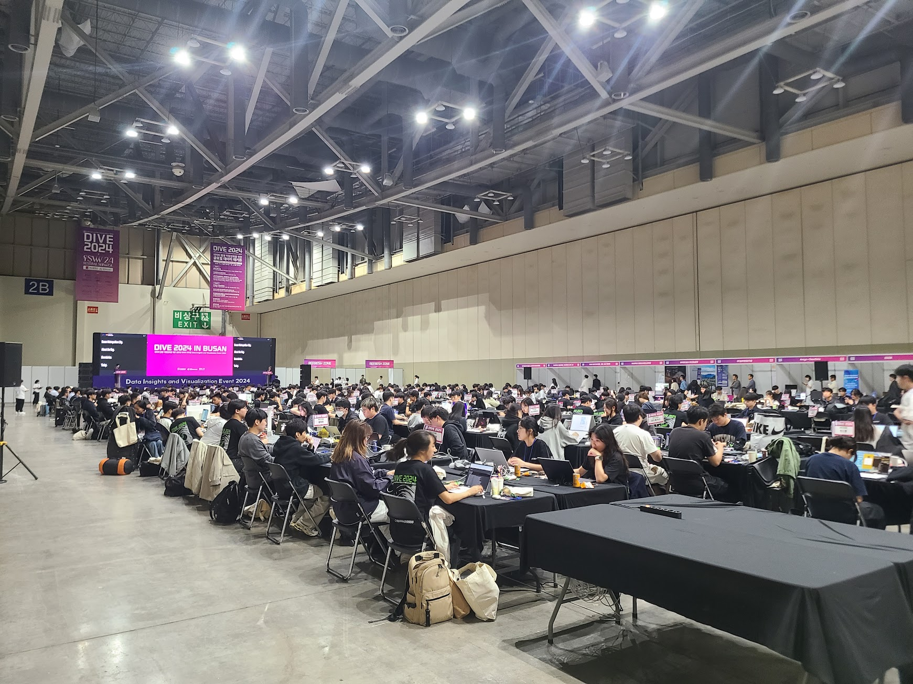
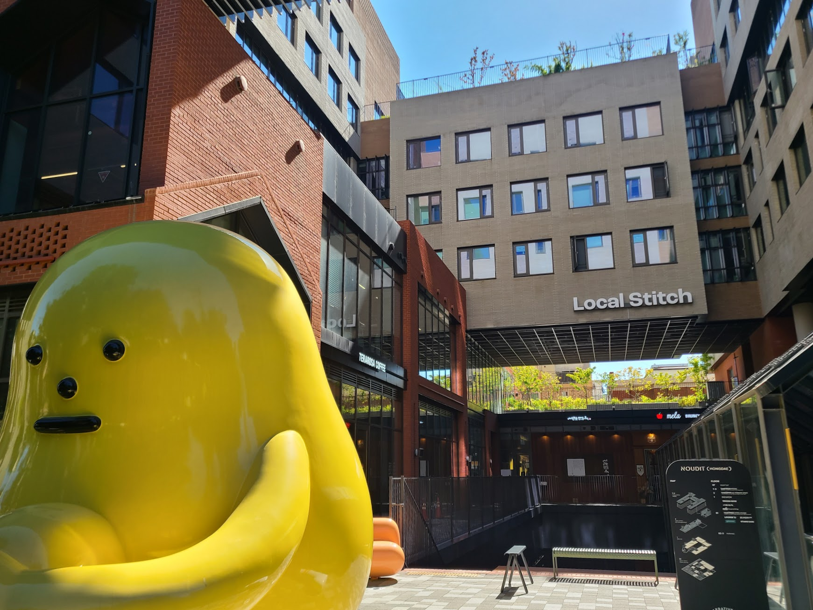
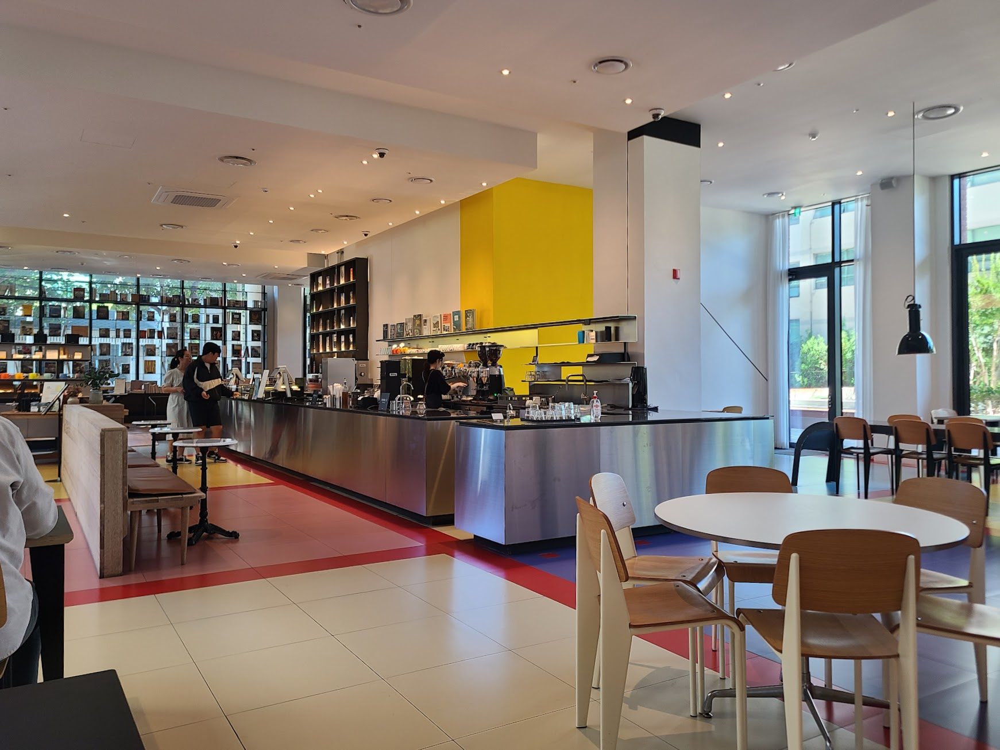
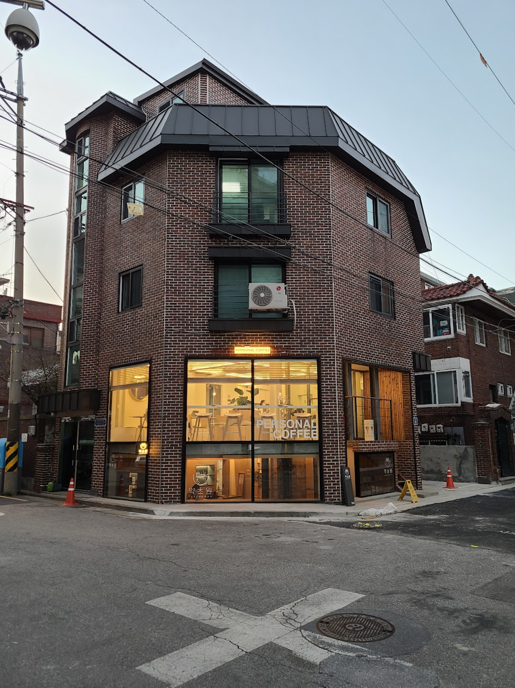
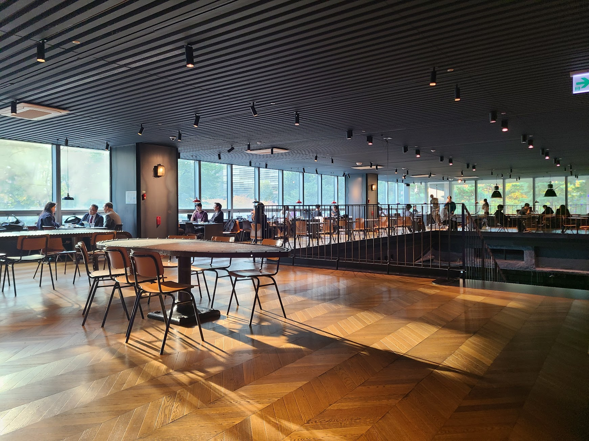

## 문제 1

Q: 다음 이미지에 대한 설명 중 옳지 않은 것은 무엇인가요?
- (1) 많은 사람들이 테이블에 앉아 노트북을 사용하고 있습니다.
- (2) "DIVE 2024 IN BUSAN"이라는 문구가 보이는 큰 화면이 있습니다.
- (3) 행사장은 매우 작고 협소한 공간입니다.
- (4) 전시회나 컨퍼런스와 같은 이벤트가 진행 중인 것으로 보입니다.

정답: (3) 행사장은 매우 작고 협소한 공간이 아닙니다.

---------------------

## 문제 2

Q: 다음 이미지에 대한 설명 중 옳지 않은 것은 무엇인가요?
- (1) 노란색 조형물이 보입니다.
- (2) 건물 위에는 "Local Stitch"라는 글자가 있습니다.
- (3) 조형물의 색상은 초록색입니다.
- (4) 건물의 일부는 붉은 벽돌로 이루어져 있습니다.
    
정답: (3) 조형물의 색상은 노란색입니다.

---------------------

## 문제 3

Q: 다음 이미지에 대한 설명 중 옳지 않은 것은 무엇인가요?
- (1) 카페 안에 테이블과 의자가 배치되어 있습니다.
- (2) 바리스타가 음료를 준비하고 있는 모습입니다.
- (3) 바 뒤 벽은 노란색으로 칠해져 있습니다.
- (4) 밖에는 기차가 지나가고 있습니다.

정답: (4) 밖에는 기차가 지나가고 있습니다. (기차는 보이지 않습니다.)

---------------------

## 문제 4

Q: 다음 이미지에 대한 설명 중 옳지 않은 것은 무엇인가요?
- (1) 건물은 벽돌로 지어져 있습니다.
- (2) 건물 앞에 주황색 안전콘이 놓여 있습니다.
- (3) 건물 창문에 "PERSONAL COFFEE"라는 글자가 보입니다.
- (4) 건물 옥상에 정원 데크가 설치되어 있습니다.

정답: (4) 건물 옥상에 정원 데크가 설치되어 있지 않습니다.

---------------------

## 문제 5

Q: 다음 이미지에 대한 설명 중 옳지 않은 것은 무엇인가요?
- (1) 여러 종류의 빵이 진열되어 있습니다.
- (2) 직원이 빵을 진열하고 있습니다.
- (3) 빵의 가격표와 이름이 적혀 있습니다.
- (4) 점원의 모자는 빨간색입니다.

정답: (4) 점원의 모자는 빨간색이 아닌 다른 색입니다.

---------------------

## 문제 6

Q: 다음 이미지에 대한 설명 중 옳지 않은 것은 무엇인가요?
- (1) 이미지에는 사람들이 구조물을 작업하고 있는 모습이 담겨 있습니다.
- (2) 나무 뒤에는 빨간색 플라스틱 의자가 쌓여 있습니다.
- (3) "뉴트리코어"라는 간판이 보입니다.
- (4) 멀리 하늘이 흐리고 비가 내리고 있습니다.

정답: (4) 멀리 하늘이 흐리고 비가 내리고 있지는 않습니다.

---------------------

## 문제 7

Q: 다음 이미지에 대한 설명 중 옳지 않은 것은 무엇인가요?
- (1) 사람들은 테이블에 앉아 대화를 나누고 있습니다.
- (2) 바닥은 나무로 된 패턴입니다.
- (3) 창문으로 자연광이 들어오고 있습니다.
- (4) 모든 사람들이 일어서서 걷고 있습니다.

정답: (4) 모든 사람들이 일어서서 걷고 있는 것이 아니라, 테이블에 앉아 있는 사람들도 있습니다.

---------------------

## 문제 8

Q: 다음 이미지에 대한 설명 중 옳지 않은 것은 무엇인가요?

- (1) 사람들은 버스 앞에 줄을 서 있습니다.
- (2) 사진은 커피숍 안에서 찍은 것으로 보입니다.
- (3) 사람들이 나무 아래 서 있는 모습이 보입니다.
- (4) 모든 사람들은 검은색 옷을 입고 있습니다.

정답: (4) 모든 사람들은 검은색 옷을 입고 있는 것이 아닙니다. 다양한 색상의 옷을 입고 있습니다.

---------------------

