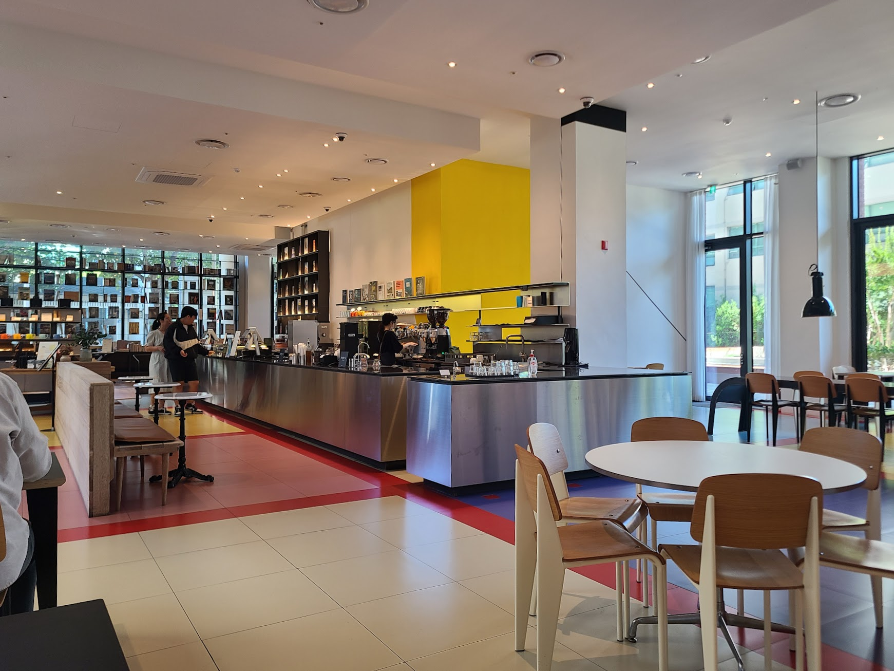
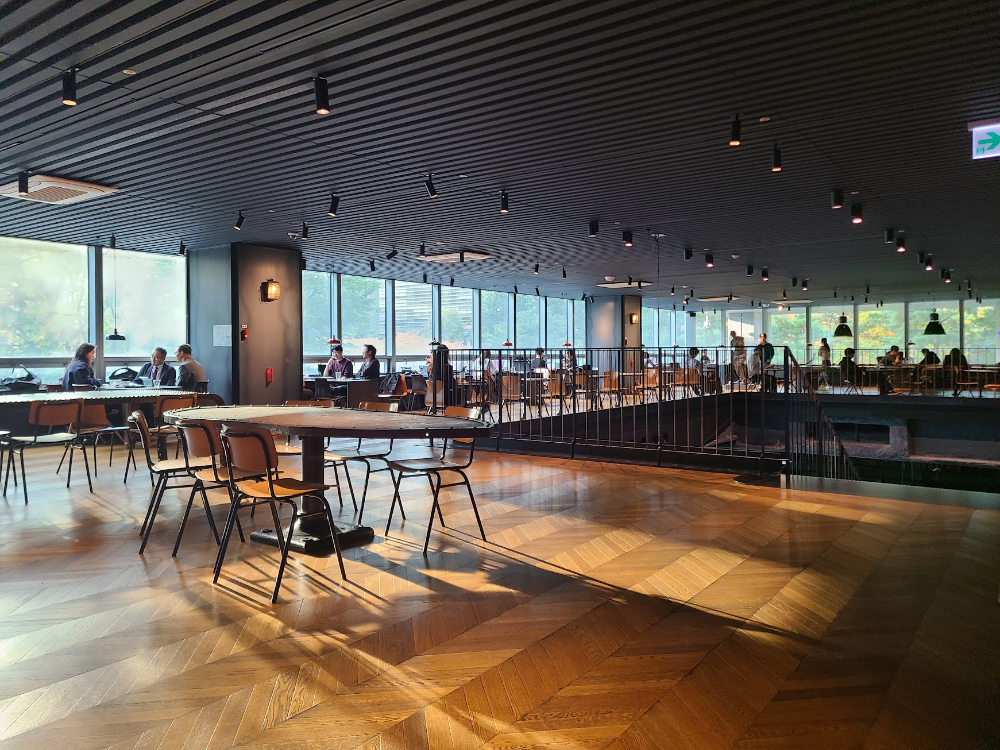

## 문제 1

Q: 다음 이미지에 대한 설명 중 옳지 않은 것은 무엇인가요?
- (1) 많은 사람들이 테이블에 앉아 노트북으로 작업하고 있습니다.
- (2) 행사장의 벽에 "DIVE 2024 IN BUSAN"이라고 쓰인 큰 배너가 보입니다.
- (3) 참가자들은 모두 노란색 티셔츠를 입고 있습니다.
- (4) 행사장은 실내 공간입니다.

Listening: Which of the following descriptions of the image is incorrect?
- (1) Many people are sitting at tables, working on laptops.
- (2) A large banner on the wall of the venue reads "DIVE 2024 IN BUSAN."
- (3) All participants are wearing yellow T-shirts.
- (4) The event is being held in an indoor space.

정답: (3) 참가자들은 모두 노란색 티셔츠를 입고 있는 것이 아닙니다.

---------------------

## 문제 2

Q: 다음 이미지에 대한 설명 중 옳지 않은 것은 무엇인가요?
- (1) 카페 안에는 사람들이 앉아서 대화하고 있습니다.
- (2) 카운터 뒤에 노란색 벽이 있습니다.
- (3) 여러 개의 빈 테이블과 의자가 보입니다.
- (4) 카운터에서 두 명의 직원이 일하고 있습니다.

Listening: Which of the following descriptions of the image is incorrect?
- (1) People are sitting and talking inside the café.
- (2) There is a yellow wall behind the counter.
- (3) Several empty tables and chairs are visible.
- (4) Two staff members are working at the counter.

정답: (1) 카페 안에 사람들이 앉아서 대화하는 모습은 보이지 않습니다.

---------------------

## 문제 3

Q: 다음 이미지에 대한 설명 중 옳지 않은 것은 무엇인가요?
- (1) 다양한 종류의 빵이 진열대에 놓여 있습니다.
- (2) 가격표가 각 빵 앞에 붙어 있습니다.
- (3) 점원이 빵을 진열하고 있는 모습이 보입니다.
- (4) 배경 벽에 에어컨이 설치되어 있습니다.

Listening: Which of the following descriptions of the image is incorrect?
- (1) Various types of bread are displayed on the shelves.
- (2) Each bread has a price tag in front of it.
- (3) A clerk is arranging bread.
- (4) An air conditioner is installed on the background wall.

정답: (3) 점원이 빵을 진열하고 있는 모습이 보이지 않습니다.

---------------------

## 문제 4

Q: 다음 이미지에 대한 설명 중 옳지 않은 것은 무엇인가요?
- (1) 이미지는 벽돌 건물의 모퉁이를 보여줍니다.
- (2) 창문에는 "PERSONAL COFFEE"라는 글자가 보입니다.
- (3) 건물 앞에 노란색 안전 표지판이 있습니다.
- (4) 건물 옥상에 식물들이 심어져 있습니다.

Listening: Which of the following descriptions of the image is incorrect?
- (1) The image shows the corner of a brick building.
- (2) The windows display the words "PERSONAL COFFEE."
- (3) There is a yellow safety sign in front of the building.
- (4) There are plants planted on the building's roof.

정답: (4) 건물 옥상에 식물들이 심어져 있는 모습은 보이지 않습니다.

---------------------

## 문제 5

Q: 다음 이미지에 대한 설명 중 옳지 않은 것은 무엇인가요?
- (1) 사람들이 테이블에 앉아 대화하고 있습니다.
- (2) 천장 조명이 켜져 있습니다.
- (3) 창문 밖으로 바다가 보입니다.
- (4) 실내는 넓고 탁 트여 있습니다.

Listening: Which of the following descriptions of the image is incorrect?
- (1) People are sitting at tables having conversations.
- (2) The ceiling lights are on.
- (3) The sea is visible outside the windows.
- (4) The interior is spacious and open.

정답: (3) 창문 밖으로 바다가 보이는 것이 아니라 나무가 보입니다.

---------------------

## 문제 6

Q: 다음 이미지에 대한 설명 중 옳지 않은 것은 무엇인가요?
- (1) 작업자들이 건물 외부에서 작업을 하고 있습니다.
- (2) 'pomme verte'라는 상점 이름이 보입니다.
- (3) 나무가 건물 옆에 심겨져 있습니다.
- (4) 사람들은 카페에서 커피를 마시고 있습니다.

Listening: Which of the following descriptions of the image is incorrect?
- (1) Workers are working outside the building.
- (2) There is a store name 'pomme verte' visible.
- (3) A tree is planted beside the building.
- (4) People are drinking coffee at the café.

정답: (4) 사람들은 카페에서 커피를 마시고 있지 않습니다.

---------------------

## 문제 7

Q: 다음 이미지에 대한 설명 중 옳지 않은 것은 무엇인가요?
- (1) 사람들이 버스를 타기 위해 줄을 서 있습니다.
- (2) 이미지에 보이는 건물은 유리로 된 외관을 가지고 있습니다.
- (3) 대기 중인 사람들은 모두 흰색 옷을 입고 있습니다.
- (4) 몇몇 사람들은 스마트폰을 사용하고 있습니다.

Listening: Which of the following descriptions of the image is incorrect?
- (1) People are lining up to board a bus.
- (2) The building visible in the image has a glass exterior.
- (3) All the people waiting are wearing white clothes.
- (4) Some people are using smartphones.

정답: (3) 대기 중인 사람들은 다양한 색상의 옷을 입고 있습니다.

---------------------

## 문제 8

Q: 다음 이미지에 대한 설명 중 옳지 않은 것은 무엇인가요?
- (1) 노란색 조형물이 보입니다.
- (2) 건물에 "Local Stitch"라는 글자가 있습니다.
- (3) 조형물 옆에는 파란색 벤치가 있습니다.
- (4) 여러 개의 창문이 건물에 보입니다.

Listening: Which of the following descriptions of the image is incorrect?
- (1) There is a yellow sculpture visible.
- (2) The building has the words "Local Stitch" on it.
- (3) There is a blue bench next to the sculpture.
- (4) Multiple windows are visible on the building.

정답: (3) 조형물 옆에는 파란색 벤치가 아닌 다른 색 벤치가 있습니다.

---------------------

